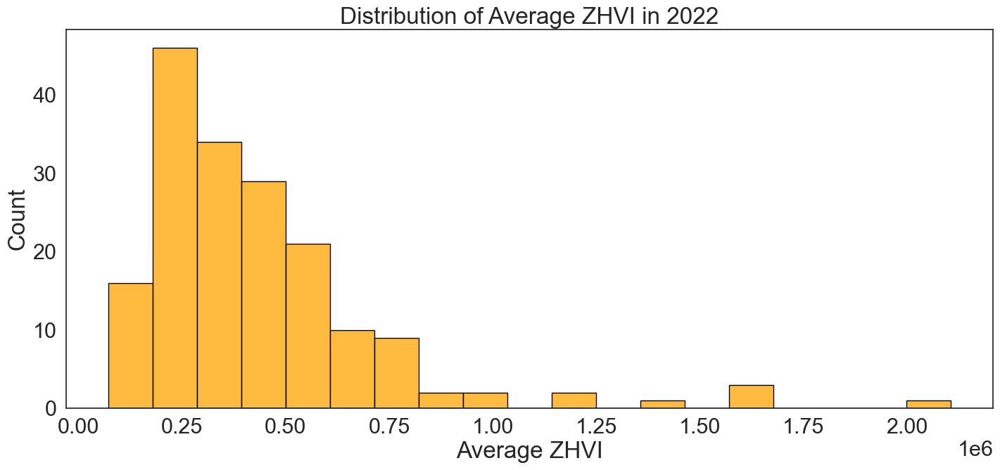

# Crime and Housing Analysis

## File Navigation:
- crime.csv: 2022 FBI Crime Rate Dataset 
- FinalProject_Group121_WI24.ipynb: Full project write up and analysis

## Background and Overview
When individuals are making decisions on where to relocate based on job opportunities, amenities, or accessibility to public transit, one of the largest factors often includes safety. Here, we measure safety by crime rates and identify the relationship between Violent Crime rate Reports and Housing Values across the U.S. 

This report intends to do the following in Sections 1 and 2:

1) Identify whether or not there is a connection between FBI reported crime rates and single family housing values across cities. 
2) Examine the relationship between FBI reported crime rates and single family housing values on a regional level.

>[!NOTE]
>Analysis is only conducted on 2022 data. This is mainly due to the fact that the [2021 FBI Crime Rate data](https://www.themarshallproject.org/2022/10/08/the-problem-with-the-fbi-s-missing-crime-data) was largely incomplete after the FBI switched out their data collection system to the National Incident-Based Reporting System (NIBRS). Consequently, missingness in data was high since ~7,000 police agencies had failed to switch systems. 

## Datasets and Organization
| Dataframe               | Source                               | # of States | # of Observations | Missingness/Excluded Data                        |
|-------------------------|--------------------------------------|-------------|-------------------|--------------------------------------------------|
| crime                   | 2022 FBI Crime Reports              | 40          | 188               | Excludes 10 states, but no null values.         |
| housing                 | Zillow ZHVI for single family homes in 2022 | 50          | 20,636            | No missingness.                                 |
| crime_and_housing_val   | Combination of crime and housing.   | 40          | 177               | Excludes 10 states.                             |

## Statistical Analysis
We decided to analyze the relationship between our variables using a Spearmen Correlation test since our data modeling exhbited a non-linear correlation between Violent Crime Rate and Home Value Indices. 

>[!NOTE]
>A Spearmen rank correlation examines the relationship between two variables and does not depend on a linear relationship. A stronger, positive correlation will be closer to +1, while a lower, dissimilar correlation is closer to a value of -1. 

## Findings

