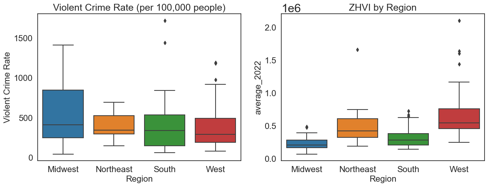

# Crime and Housing Analysis

## File Navigation:
- crime.csv: 2022 FBI Crime Rate Dataset 
- FinalProject_Group121_WI24.ipynb: Full project write up and analysis. See file for in depth EDA and Ethics/Privacy.

## Background and Overview
When individuals are making decisions on where to relocate based on job opportunities, amenities, or accessibility to public transit, one of the largest factors often includes safety. Here, we measure safety by crime rates and identify the relationship between Violent Crime rate Reports and Housing Values across the U.S. 

This report intends to do the following in Sections 1 and 2:

1) Identify whether or not there is a connection between FBI reported crime rates and single family housing values across cities. 
2) Examine the relationship between FBI reported crime rates and single family housing values on a regional level.

>[!NOTE]
>Analysis is only conducted on 2022 data. This is mainly due to the fact that the [2021 FBI Crime Rate data](https://www.themarshallproject.org/2022/10/08/the-problem-with-the-fbi-s-missing-crime-data) was largely incomplete after the FBI switched out their data collection system to the National Incident-Based Reporting System (NIBRS). Consequently, missingness in data was high since ~7,000 police agencies had failed to switch systems. 

## Datasets and Organization
| Dataframe               | Source                               | # of States | # of Observations | Missingness/Excluded Data                        |
|-------------------------|--------------------------------------|-------------|-------------------|--------------------------------------------------|
| crime                   | 2022 FBI Crime Reports              | 40          | 188               | Excludes 10 states, but no null values.         |
| housing                 | Zillow ZHVI for single family homes in 2022 | 50          | 20,636            | No missingness.                                 |
| crime_and_housing_val   | Combination of crime and housing.   | 40          | 177               | Excludes 10 states.                             |

## Statistical Analysis
We decided to analyze the relationship between our variables using a Spearmen Correlation test since our data modeling exhbited a non-linear correlation between Violent Crime Rate and Home Value Indices. 

>[!NOTE]
>A Spearmen rank correlation examines the relationship between two variables and does not depend on a linear relationship. A stronger, positive correlation will be closer to +1, while a lower, dissimilar correlation is closer to a value of -1. 

## Findings

### Descriptive Statistics:
Descriptive Statistics:

| Region     | Violent Crime Rate | average_2022     |
|------------|--------------------|------------------|
| midwest    | 523.183258         | 233259.354064    |
| northeast  | 388.811669         | 538087.532439    |
| south      | 385.838530         | 316623.388311    |
| west       | 368.179761         | 653252.965102    |

The Midwest has the highest mean violent crime rate at about 523.18, but the lowest average home value index at about 233259.35. Conversely, we can also see that the West has the lowest mean violent crime rate at about 368.18 and the highest average home value index at about 6.53e+05. The northeast does not follow the predicted trend; despite being ranked as the second highest crime rate region, it still has a relatively high average home value index and is ranked as the second most expensive.

### Spearmen Correlations:
| Region    | Correlation        |
|-----------|--------------------|
| midwest   | -0.6451612903225806|
| northeast | -0.4895104895104896|
| south     | -0.5566792056687954|
| west      | -0.4245423182493516|

Upon conducting a Spearman correlation analysis between violent crime rates and average home values across all regions, we observed a consistent negative correlation. This suggests that areas with lower violent crime rates tend to exhibit higher average home values, while regions with higher crime rates tend to have lower average home values. The strongest negative correlation was observed in the Midwest, followed by the South, Northeast, and West.

In the **Midwest** region, we found the strongest negative correlation, with a Spearman correlation coefficient of about **-0.65**. This information is consistent with our boxplots above, as we saw the Midwest had higher crime rates and a low concentration of home value indices than the other regions. 

Following the Midwest, the **South** region exhibited the next strongest negative correlation, with a coefficient of **-0.56**. In the **Northeast** region, we observed a moderate negative correlation, with a coefficient of **-0.49**. Lastly, the **West** region displayed the weakest negative correlation, with a coefficient of **-0.42**. Overall, these Spearman correlation coefficients are not strong enough to be considered causational, but they do provide valuable insights into the relationship between violent crime rates and average home values for these regions. 

## Conclusion
After exploring and analyzing our data on differing home values in accordance with crime rates, we reject our hypothesis that cities with higher housing values are associated with lower crime rates, while cities with lower housing values are associated with higher crime rates. Each region possesses a negative correlation in the spearman correlation tests we ran, with the Midwest showing the strongest negative correlation, indicating low housing values and high crime rates, which is consistent with our hypothesis. While the Northeast, South, and North regions also show a negative correlation, they are not strong enough to make a statement on whether our data and analysis supports our hypothesis, hence why we reject it. Ultimately, there are no profound findings that would lead us to firmly conclude whether or not home values are correlated with certain crime rates.